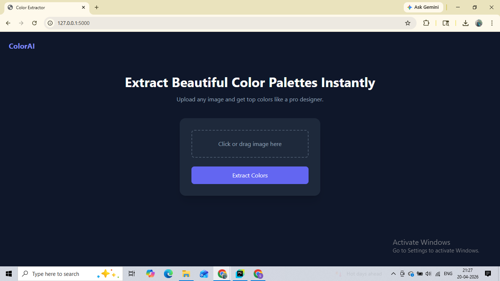
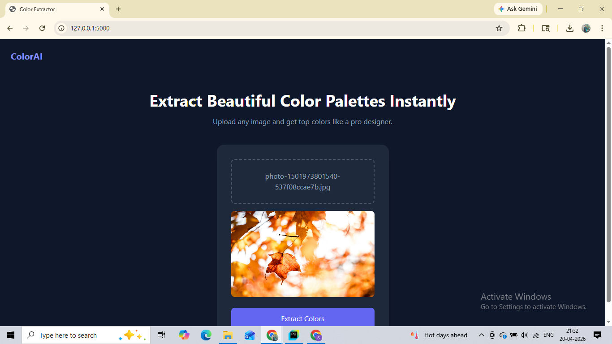
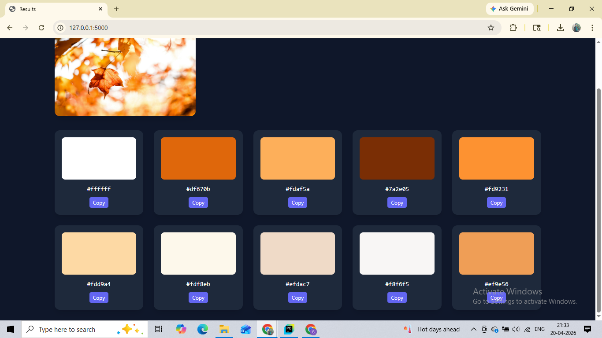

# 🎨 Color Palette Extractor

A modern web app that extracts the top 10 dominant colors from any uploaded image.

---

## 🚀 Features

- Upload image and extract dominant colors
- Drag & drop support
- Instant image preview
- HEX color palette display
- Copy-to-clipboard functionality
- Clean SaaS-style UI

---

## 🖼️ Demo

### 🏠 Homepage


### 📤 Image Upload Preview


### 🎯 Extracted Color Palette


---

## 🛠️ Tech Stack

- Python (Flask)
- Pillow (Image Processing)
- HTML + Tailwind CSS
- JavaScript (Vanilla)

---

## ⚙️ Installation

```bash
git clone https://github.com/your-username/color-palette-extractor.git
cd color-palette-extractor
pip install -r requirements.txt
python run.py